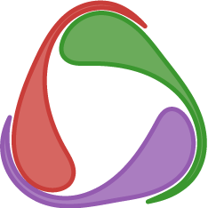
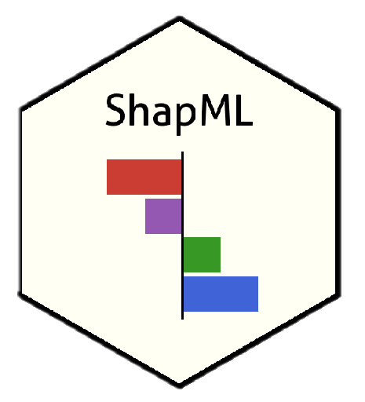

<h1 align="center">👋 Aloha, I'm Sam!</h1>

  <em>Currently Grad @ UC Santa Cruz | Tinkering With SOTA AI, Scientific Computing, AI Safety & Agentic Frameworks</em>

  <strong>Past:</strong> SDE-II @ Acko • Building Full Stack Mobile UI & Server-Driven Systems 
  <strong>Fellowship:</strong> MLH Fellow • Celo Fellowship 
  <strong>Community:</strong> Lead @ Google DSC • Lead @ Polygon

---

## 🚀 About Me

I'm passionate about pushing the boundaries of AI and building scalable systems. Currently pursuing my Grad studies at UC Santa Cruz while exploring cutting-edge AI, scientific computing, and agentic frameworks. Previously led engineering efforts at Acko, developing sophisticated mobile and server-driven architectures.

I'm currently building [**Arctic Protocol**](https://github.com/ArcticProtocol), a suite of products and tooling to tackle climate change. If this mission resonates with you, check it out—we're an open community welcoming contributors!

---

## 💻 Top Languages

  

---

## 🛠️ Tech Stack

  

---

## 🤖 AI

  
  
  
  
  

---

## 📫 Connect With Me

  
  
  

---
